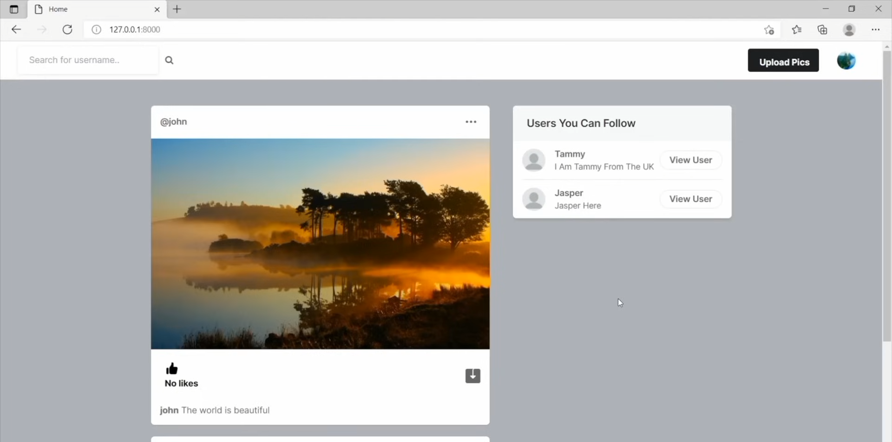
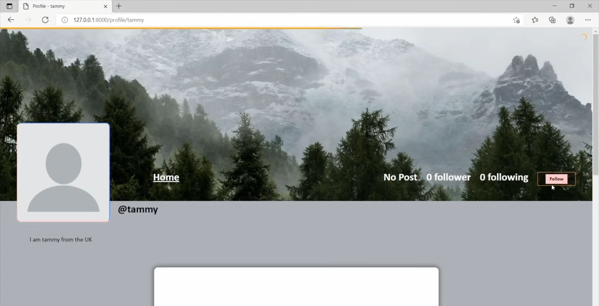

# Social Media Website 
A Django-based social media platform with Docker and Kubernetes deployment

## Project Architecture
The social media website is an Instagram-like clone where people can make accounts, follow each other, and post pictures. This project was created during my backend journey, and future features will include:
1. Commenting feature
2. Direct messaging feature
3. AI conversation page using Ollama 3B

## Technologies Used
- Django: Backend framework
- PostgreSQL: Database
- Docker: For containerization, packaging the application and its dependencies
- Kubernetes: For orchestration, managing container deployment, scaling, and networking
- Minikube: Local Kubernetes environment for testing and development
- kubectl: CLI for interacting with Kubernetes clusters

## Prerequisites
Before running the application, ensure you have the following installed:
- Docker Desktop
- Kubernetes CLI (kubectl)
- Minikube
- Python 3.10+

## Prerequisites Installation
### First, make sure these tools are installed:
### Check if tools are installed
docker --version
kubectl version
minikube version

## For Windows, use chocolatey:
choco install docker-desktop
choco install kubernetes-cli
choco install minikube

## Step 1: Clone and Setup Project
### Clone the project (if using git)
git clone <repository-url>
cd social_media_website

### If files are provided directly, ensure you have:
- Dockerfile
- docker-compose.yml
- requirements.txt
- kubernetes yaml files (postgres.yaml, django.yaml)
 - Django project files

## Step 2: Start Kubernetes Cluster
## Start minikube
minikube start

## Point Docker to minikube's Docker daemon (for Windows PowerShell)
minikube docker-env | Invoke-Expression

## Step 3: Build and Deploy
## Build the Docker image
docker build -t app-web .

## Apply Kubernetes configurations
kubectl apply -f  kubernetes/postgres.yaml
kubectl apply -f kubernetes/django.yaml

##  Verify deployments
kubectl get pods
kubectl get services

## Step 4: Database Setup
##  Wait for pods to be ready
kubectl get pods -w
## Once pods are running, run migrations
## Replace <django-pod-name> with actual pod name from 'kubectl get pods'
kubectl exec <django-pod-name> -- python manage.py migrate
kubectl exec <django-pod-name> -- python manage.py collectstatic --noinput

## Step 5: Access the Application
## Get the application URL
minikube service django

## This will open the application in your default browser
Common Commands for Management
## View all resources
kubectl get all

## View logs
kubectl logs <pod-name>

## Access Django shell
kubectl exec -it <django-pod-name> -- python manage.py shell

## Access PostgreSQL
kubectl exec -it <postgres-pod-name> -- psql -U django -d 

## Stop the cluster
minikube stop

## Start the cluster again
minikube start

## Technologies Used
Docker: For containerization, packaging the application and its dependencies.
Kubernetes: For orchestration, managing container deployment, scaling, and networking.
Minikube: Local Kubernetes environment for testing and development.
kubectl: CLI for interacting with Kubernetes clusters.

This project deploy on Docker and Kubernetes.
